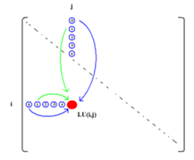
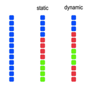
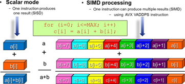
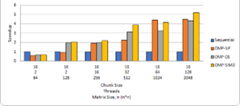

# LU Decomposition using OpenMP

LU Decomposition is the factorization of a square matrix into two triangular matrices (one lower and one upper) where multiplying the resulting matrices gives the original matrix. This project is a desktop App that aims to accelerate LU Decomposition with OpenMP. 

## Technologies Used

- Programming Language: C++
- Technologies:
  - OpenMP, API for multiprocessing programming

## Project Details

### Algorithm

The original algorithm is based on the Crout's algorithm for LU Decomposition [Reference](https://vismor.com/documents/network_analysis/matrix_algorithms/S4.SS3.php).

### Approach

3 methods are used in an attempt to speed up this algorithm: loop parallelism, scheduling, and SIMD parallelism.

1. Instruction-level, loop parallelism (OMP-ILP) 
  - "for-loop" parallelism

2. OMP-ILP + OpenMP Scheduling (OMP-DS)
  - Add dynamic scheduling (by default, OpenMP performs static scheduling)

3. OMP-DS + data-level, SIMD parallelism (OMP-SIMD)
  - Add in Single Instruction, Multiple Data (SIMD), or better known as data-leveling parallelism (SIMD), to indicate that multiple iterations of the loop can be executed concurrently by using SIMD instructions.
  - For testing purposes, the thread size, and scheduling algorithm that nets the best scheduling times from solution OMP-DS will be taken to test SIMD instructions.

### Results

- For matrix size at 256x256 and above, as the number of threads increases, the performance generally increases. Maximum speedup is observed at the highest matrix size, 2048x2048.
- At size 128x128 and below for the matrix size, slowdown is observed.
- For OMP-SIMD, the speedup ranges from 2.1 times at 128x128 to 5.2 times at 2048x2048. This makes OMP-SIMD by far the fastest implementation among all the OpenMP implementations.

## Further Reading

[LU Decomposition Full Report](./LUDParallel%20Full%20Report.pdf)

## References

- Bosio, image on static vs dynamic scheduling
- Reinders & Jeffers, image on SIMD
